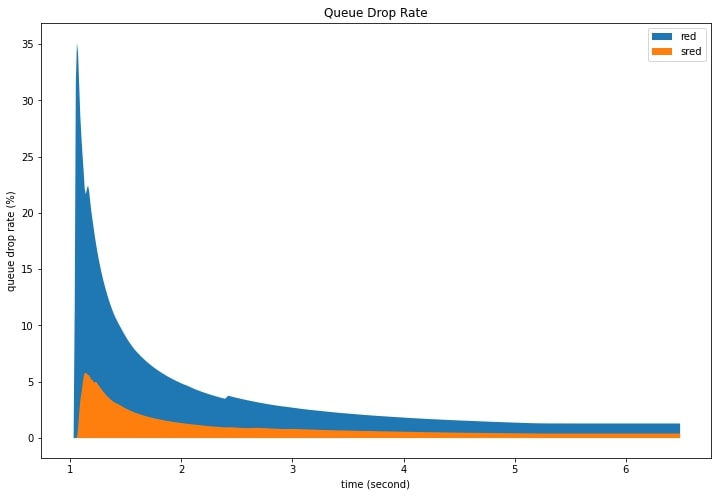
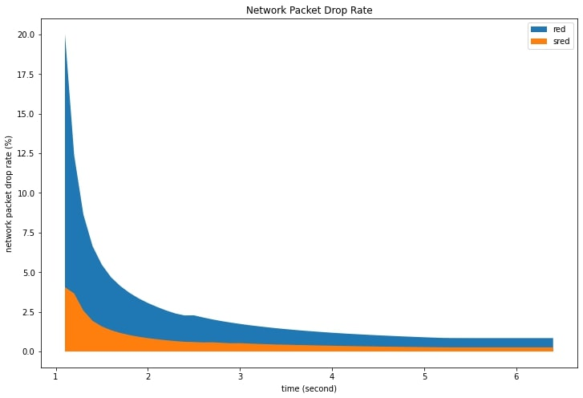
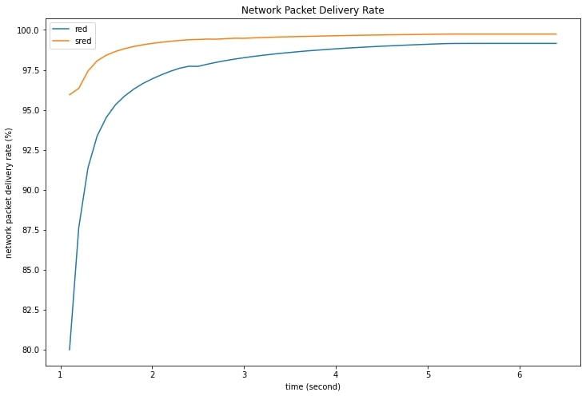
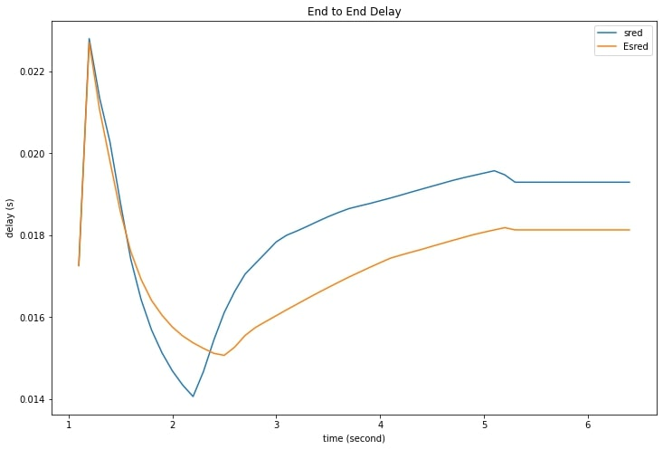
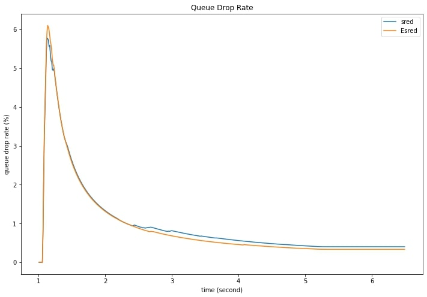
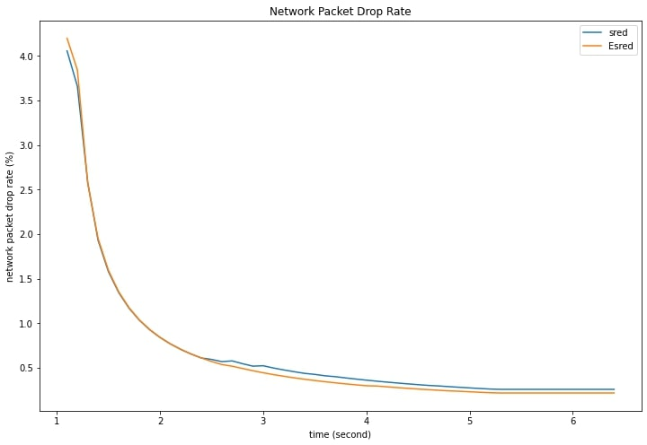
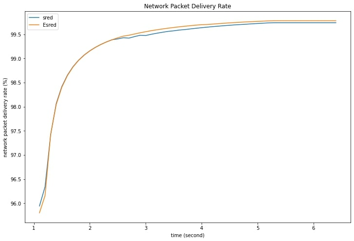

# **`SRED & ESRED : Active Queue Management in ns3`**

# **`Implementing SRED & ESRED in ns3`**

This repository describes the methodology to implement `Stabilized RED (SRED)`
Algorithm in ns3. Like `RED (Random Early Detection)` SRED pre-emptively
discards packets with a load-dependent probability when a buffer in a router in
the Internet or an Intranet seem congested. SRED has an additional feature
that over a wide range of load levels helps it stabilize its buffer occupation at a level independent of the number of active connections.

We also implement an extended version of SRED where we also consider timestamp of the incoming packets in our algorithm and adjust the probability to
overwrite accordingly. We call this `Extended Stabilized RED` or `ESRED` in short.

## `SRED`
- [Implementation](sred/stabilized-red-queue-disc.cc)
- [Simulation](simulation/wired-sred-simulation.cc)
- Comparison with `RED`

    

    

    

For a detialed explanation, implementation and network specification of the simulations please refer to the [report](Report.pdf)

## `ESRED`
- [Implementation](esred/es-red-queue-disc.cc)
- [Simulation](simulation/wired-esred-simulation.cc)

- Comparison with `SRED`

    

    

    

    

For a detialed explanation, implementation and network specification of the simulations please refer to the [report](Report.pdf)

