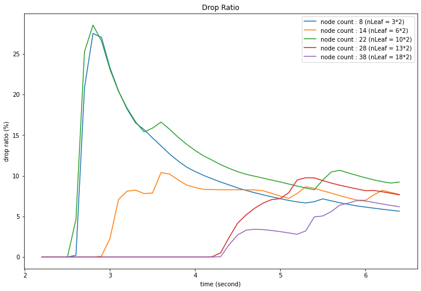
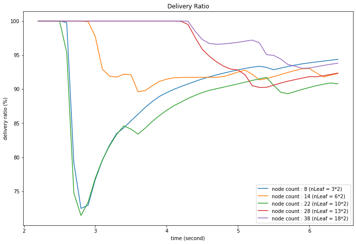
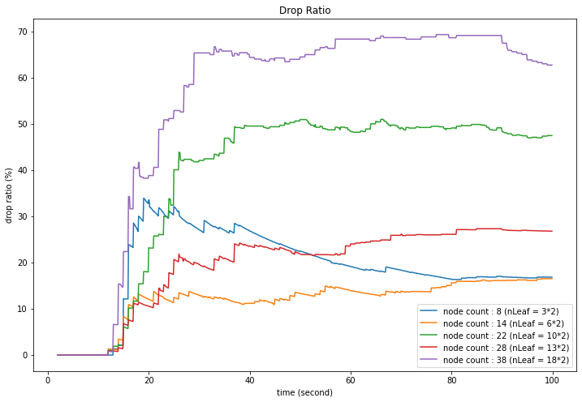
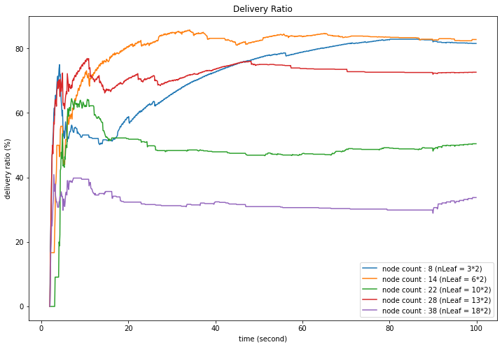

# **`SRED & ESRED : Active Queue Management in ns3`**

# **`Task A : Wireless high-rate (mobile)`**

## **Topology**

## **Simulation**

- [Code](wireless-high-rate/wireless-high-rate.cc)
- [Parameter Variation Graphs](drawings/wifi)

## **Sample Graph Outputs**

# **`Task B : Wireless low-rate (static)`**

## **Topology**

## **Simulation**

- [Code](wireless-low-rate/wireless-low-rate.cc)
- [Parameter Variation Graphs](drawings/lrpwan)

